#Lab01_AWS_Account_Setup_MFA
MFA helps to verify that who is logging in is who the intended user actually is. This can help prevent unwanted access which is especially important to have enabled for the root account because a threat actor could gain access to the entire system. The concept of least-privlege is extremely important as it gives poeple only the permissions they need for the immediate work being done. If the user needs more permissions they can switch to a higher privileged account to complete the larger scale changes. 

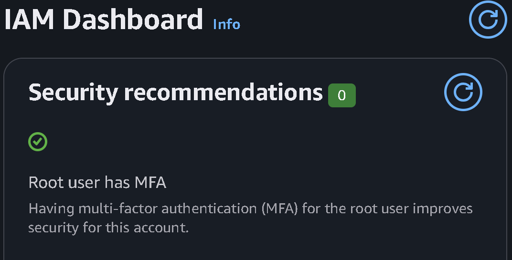
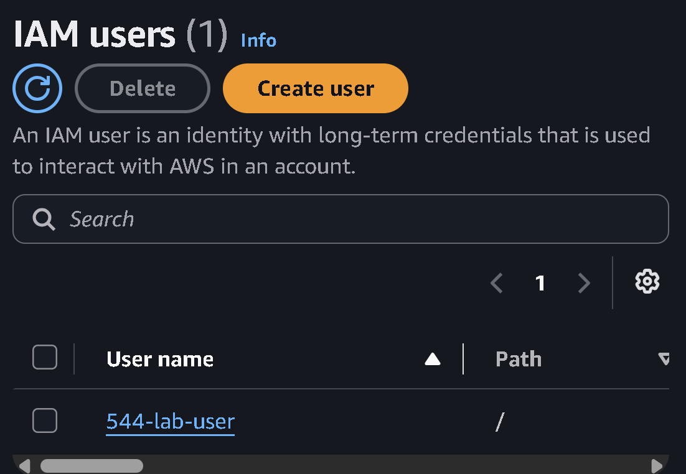
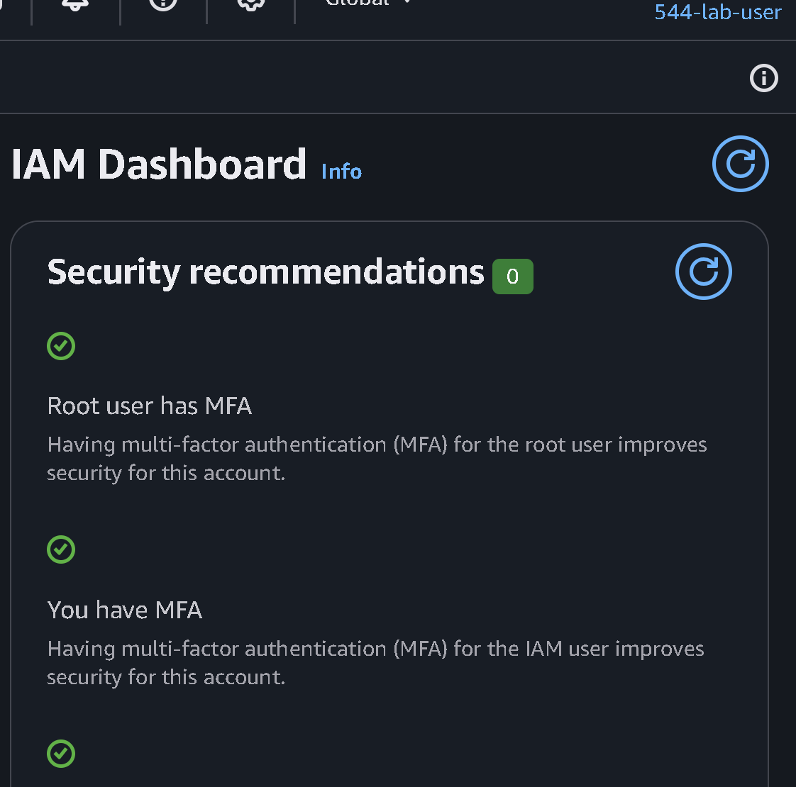
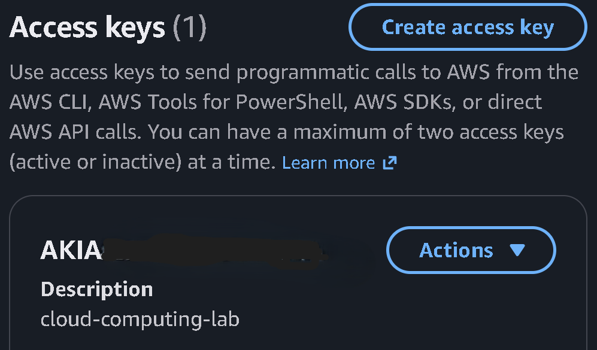

#Lab02_Docker_Linux_Container_Setup
A docker image is like a cookie cutter where you can use it to easily recreate the shape or in this case recreate a specific macine type. Similarily, a docker container is like the actual cookie that is made, in this case it is the specific instance of the machine. 

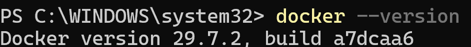
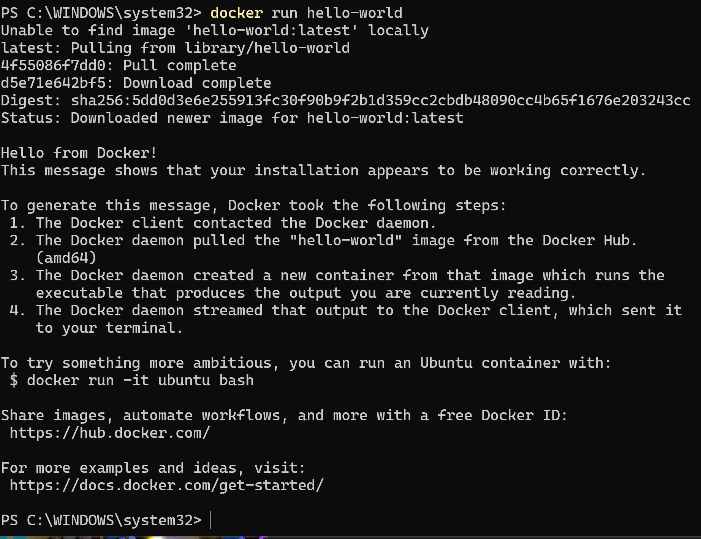
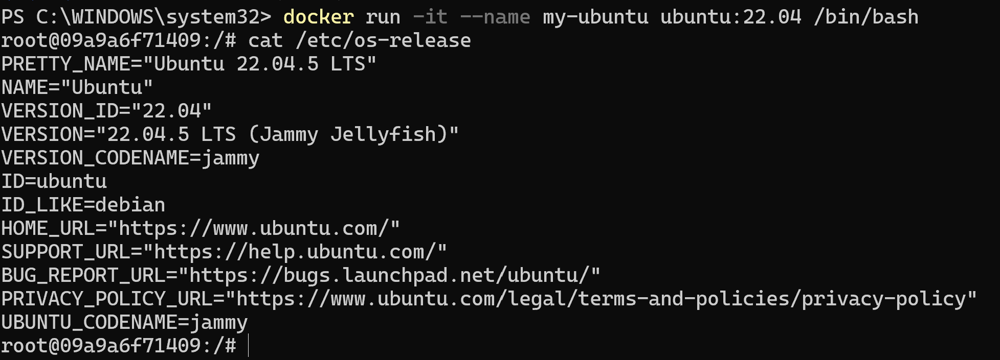
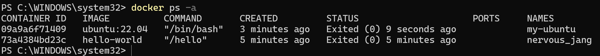
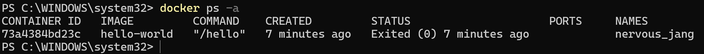

#Lab03_AWS_CLI_GitHub_Container_Setup
You should never commit AWS credentials or GitHub tokens to a repository, even if it is private, as if the repository is ever made public people can use your crednetials to act maliciously on your behalf. Stolen AWS credentials can lead to account takeover or overall data destruction. Github tokens could also allow an insider threat to steal the data and pretty much one-to-one recreate a proprietary software.  

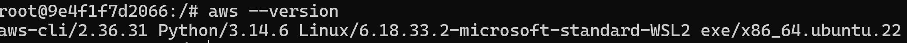
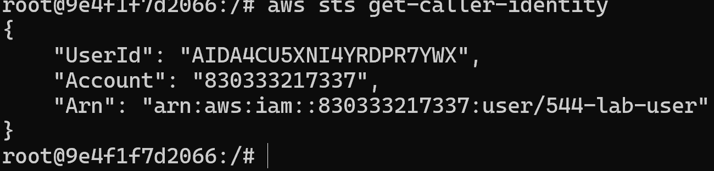
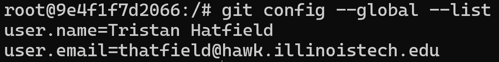
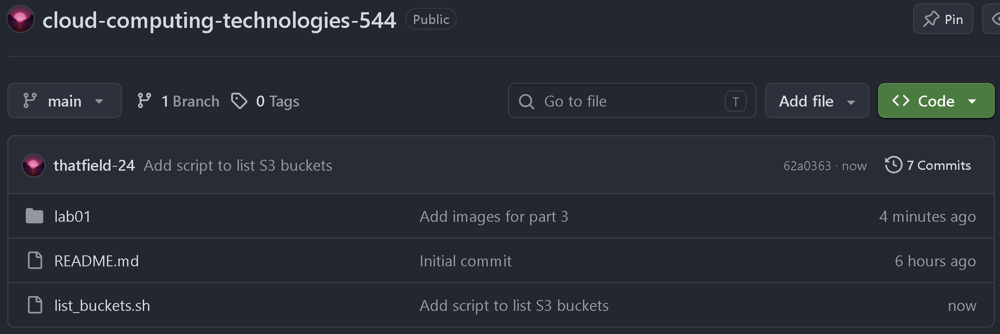