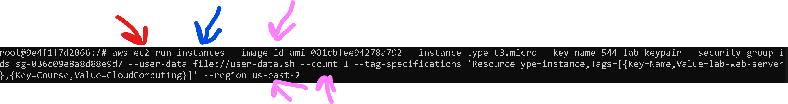
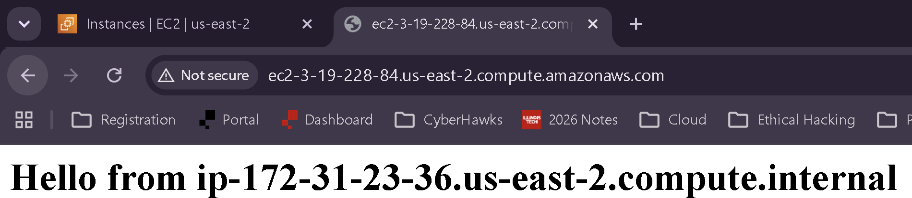
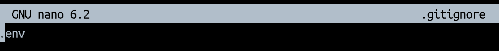
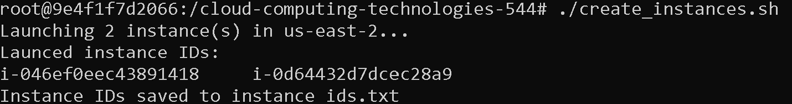
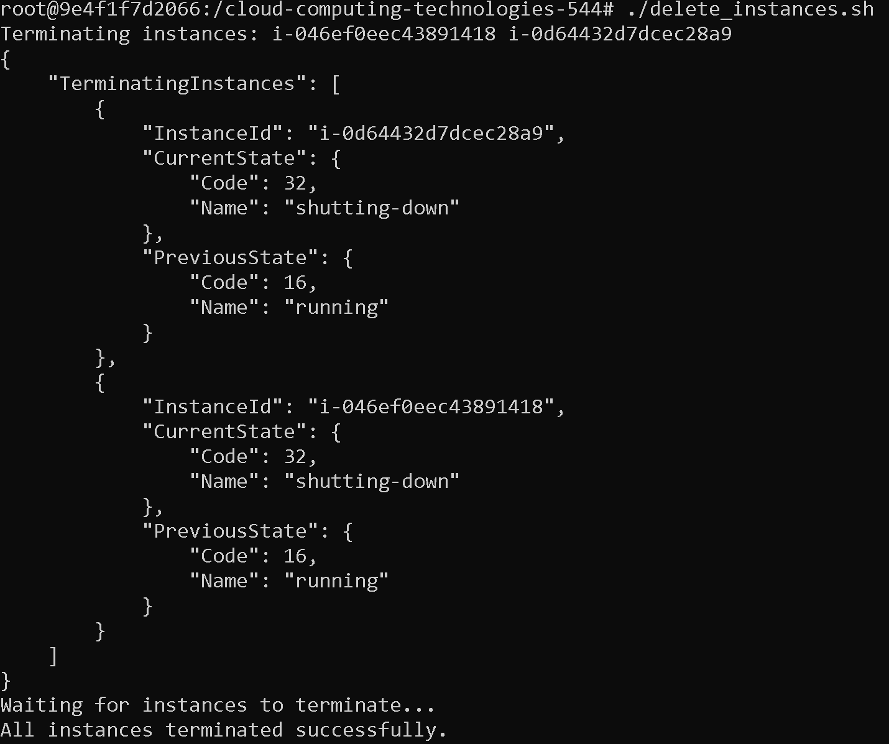

# AWS_CLI_EC2_EnvVariables
You should never commit enviornment variables to a repository, even if it is private, as if the repository is ever made public people can use the environment variables to mimic your business. In the case that there were any Github or AWS credentials on there it could be lead to the same issues as committing those alone would do. AWS credentials can lead to account takeover or overall data destruction. Github tokens could also allow an insider threat to steal the data and pretty much one-to-one recreate a proprietary software.  

Red Arrow is the AWS Service Type
Blue Arrow is the Operation Type
Pink Arrows are Parameters that can be added

