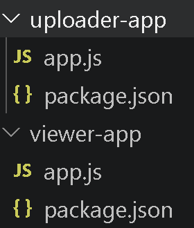

# Why should you use separate IAM roles instead of one shared role?
Using separate IAM roles enforces the principle of least privilege by ensuring that each EC2 instance receives only the exact permissions needed to perform its specific function. In this the uploader instance requires write access (s3:PutObject) while the viewwer instance only requires read access (s3:GetObject and s3:ListBucket). If a single shared role were used, an attacker could overwrite or corrupt stored data or even replace it with a malicious file. Separating these permissions into distinct roles minimizes the blast radius of a potential security compromise and ensures complete isolation between write and read operations

# Why embed code directly into user-data instead of using Git?
By encoding the source code directly into the launch template's script the EC2 instance receives all neessary files during its initial boot sequence. This allows the deployment to initiaize without needing Git SSH keys, personal access tokens, or S3 read permissions.

Screenshot of Apps Folder

Successful Upload

PNG Upload

Text File Too Large

Successful View

Second File Uploaded

Showing Both Templates

Second Launch Template Version

IAM Role Uploader

IAM Role Viewer

IP Addresses of the Apps

Successful Deletion

