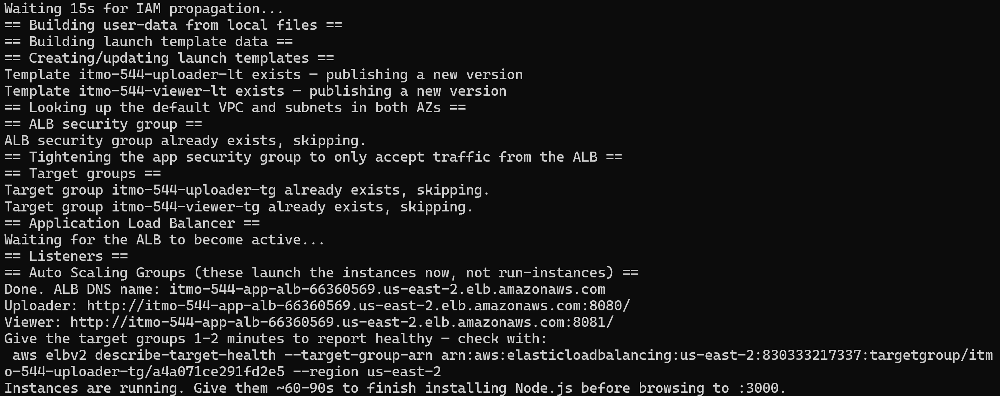
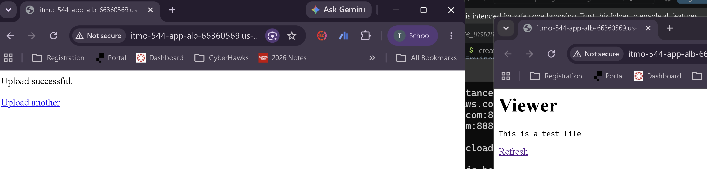
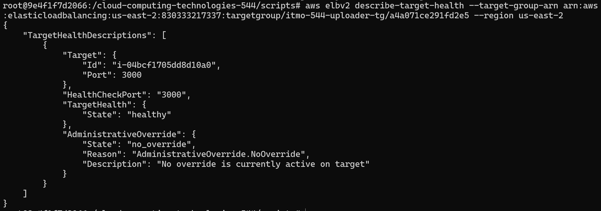
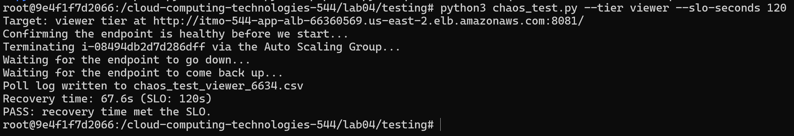
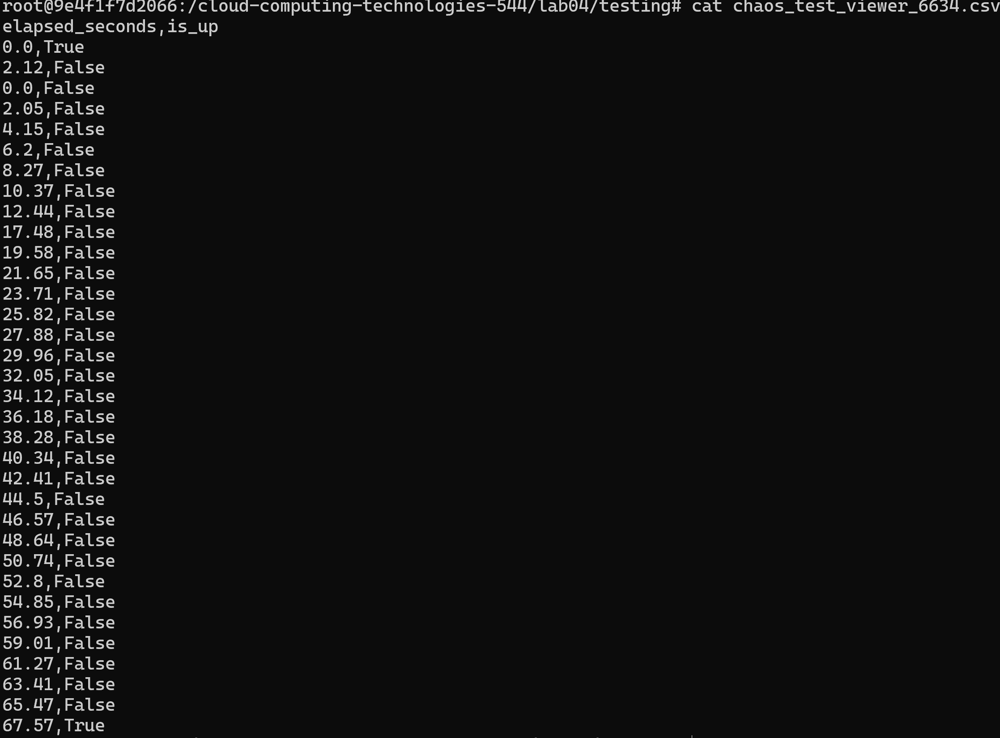
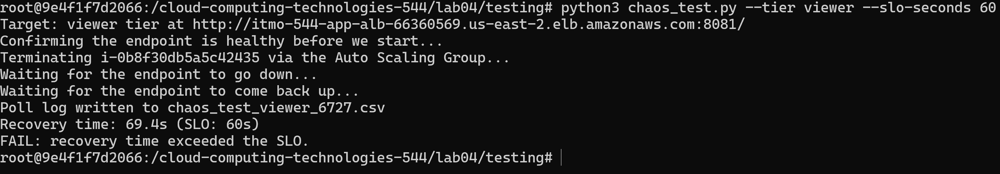
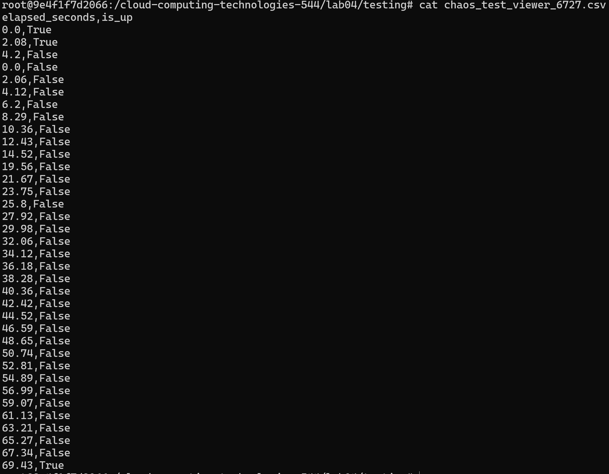
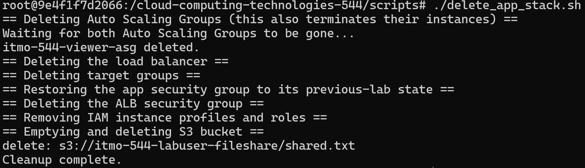

# What dominates the recovery window? health Check Timing vs boot/npm install time
In both cases the Boot/npm install time took up roughly 20s while the health check occured for an additional 20s. This means that the remaning ~roughly 25 seconds was on detection and +- a few seconds in the other categories. This is mostly equal but the installation could begin to take longer on largre applications.

# What changed in the create_app_stack and delete_app_stack scripts compared to lab03?
In the previous lab we had a line that said aws ec2 run-instances which has been replaced by a load balancer, target groups, and auto sscaling groups. These autoscaling groups move away from static provisioning and will startup a new instance if one is terminated or fails a health check. Similarly the delete_app_stack changed to first delete the auto scaling groups otherwise every time it deleted an instance a new one would just take it place. The delete script also deletes the load balancer and target groups as well. This makes sure everything is returned to the state it was in before the create script ran. 

Screenshot of Create App Stack Script

Screenshot of both apps

Healthy Status

Pass

Fail

Delete
